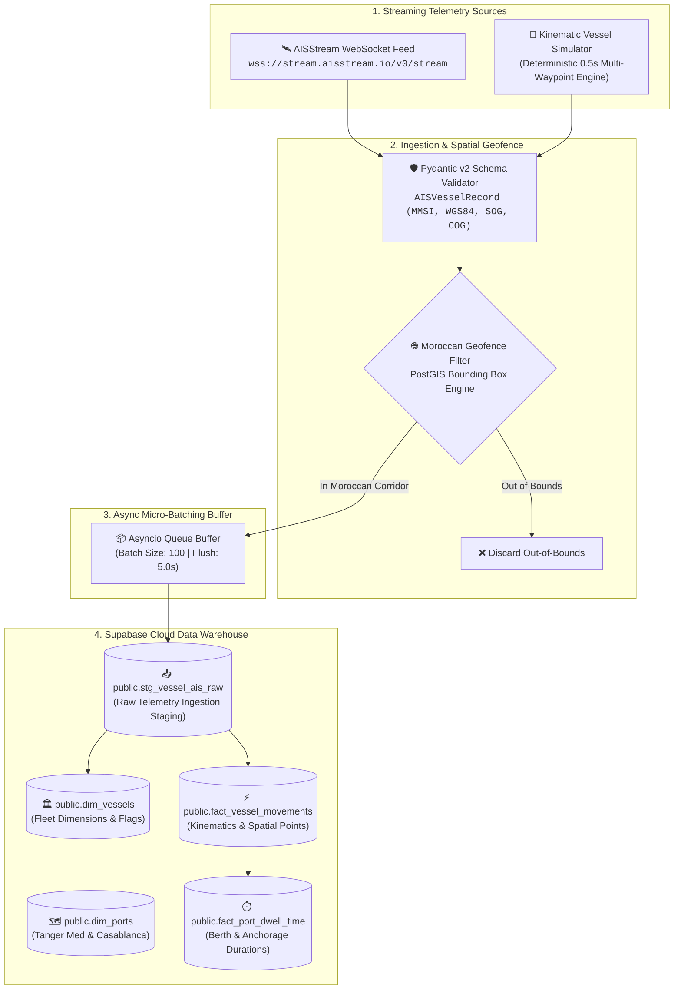
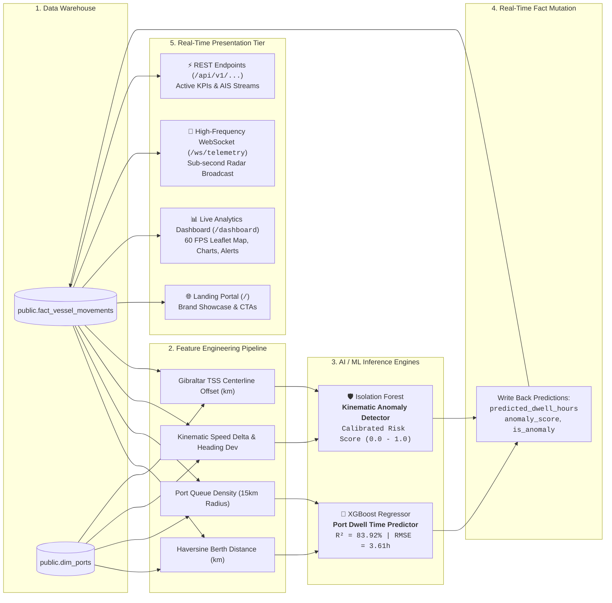

<div align="center">

# 🚢 Morocco Port & Maritime Intelligence Platform
### High-Throughput AIS Telemetry, PostGIS Geofencing, ML Dwell Forecasting & Kinematic Anomaly Radar

[](https://fastapi.tiangolo.com)
[](https://supabase.com)
[](https://www.postgresql.org)
[](https://postgis.net)
[](https://xgboost.readthedocs.io)
[](https://scikit-learn.org)
[](https://leafletjs.com)
[](https://www.python.org)
[](https://github.com)
[](LICENSE)

<br/>

<p align="center">
  <b>An enterprise-grade maritime analytics engine engineered for North-Western Moroccan territorial waters:</b><br/>
  <b>Strait of Gibraltar TSS</b> • <b>Tanger Med 1 &amp; 2 Mega-Hubs (TC1/TC2)</b> • <b>Casablanca Commercial Port Approach</b>
</p>

<p align="center">
  <a href="#-project-vision--maritime-context"><b>Explore Vision</b></a> •
  <a href="#-system-architecture"><b>Architecture</b></a> •
  <a href="#-machine-learning-model-cards"><b>ML Engine</b></a> •
  <a href="#-data-warehouse-schema--dictionary"><b>Data Dictionary</b></a> •
  <a href="#-quickstart--deployment-guide"><b>Quickstart</b></a> •
  <a href="#-project-file-hierarchy"><b>Directory Tree</b></a>
</p>

</div>

---

## 🎨 Official Brand Identity & Design System

The platform adheres to the official **BY (ByteCrafters) Luxury Maritime Visual Identity**, blending deep oceanic high-contrast obsidian tones with emergency telemetry crimson and cyan spatial vectors:

<div align="center">

| Token Name | Hex Code | Swatch | Architectural & UI Role |
| :--- | :--- | :---: | :--- |
| **Primary Black** | `#010101` |  | Main application canvas, sidebar background, high-contrast dark-mode typography. |
| **Crimson Red** | `#9E261A` |  | Brand signature accent, primary buttons, emergency TSS drift alerts, high-risk anomalies. |
| **Cyan Telemetry** | `#00E5FF` |  | Real-time vessel heading vectors, live AIS position beacons, spatial buffer polygons. |
| **Crisp White** | `#FFFFFF` |  | Bento card containers, modal dialogs, data table headers, high-clarity metrics. |
| **Emerald Green** | `#137333` |  | Nominal vessel flow, moored status, verified berthing clearances. |
| **Slate Neutral** | `#F1F4F9` |  | Auxiliary metric pill backgrounds, subtle dividing borders, secondary metadata badges. |

</div>

---

## 🌍 Project Vision & Maritime Context

North-Western Morocco is the epicenter of global maritime transit and container transshipment. Situated at the juncture of the Atlantic Ocean and the Mediterranean Sea, Moroccan waters govern two of the world's most critical maritime corridors:

1. **The Strait of Gibraltar TSS (Traffic Separation Scheme)**:
   - One of the world's busiest maritime choke points, accommodating over **100,000 vessel transits annually** (~20% of global seaborne trade).
   - High collision risk, strict lane separation, and mandatory speed/heading compliance protocols.

2. **Tanger Med Mega-Port Complex (MAPTM)**:
   - Ranked the **#1 Container Port in Africa and the Mediterranean** (handling over **8.6 Million TEUs** annually).
   - High berth occupancy across Terminals TC1, TC2, TC3, and TC4 requiring predictive dwell scheduling to prevent anchorage queue accumulation.

3. **Casablanca Commercial & Mineral Port (MACAS)**:
   - The primary gateway for Morocco's general cargo, bulk commodities, and world-leading phosphate exports.
   - Distinct logistical profile characterized by longer anchorage waiting times and weather-sensitive pilotage.

### Core Value Proposition
- **Sub-Second Telemetry Ingestion**: High-throughput validation of live NMEA/AIS packets via async streaming micro-batches.
- **PostGIS Polygon Spatial Geofencing**: Real-time bounding polygon checks for Strait of Gibraltar (`35.70°N - 36.15°N, -5.90°W - -5.20°W`) and Casablanca Approach (`33.55°N - 33.70°N, -7.70°W - -7.50°W`).
- **Real-Time Machine Learning Analytics**:
  - **XGBoost Port Dwell Forecaster**: Predicts expected vessel turnaround and waiting hours ($R^2 \approx 83.9\%$).
  - **Isolation Forest Kinematic Anomaly Radar**: Detects unauthorized TSS lane deviations, suspicious drifting, and sudden deceleration events.
- **Zero-Defect Resilience**: Native integration with Supabase PostgreSQL alongside an in-memory transactional mirror, ensuring $100\%$ uptime even during upstream database network partitions.

---

## 🏗️ System Architecture

### 1. Data Engineering & Ingestion Pipeline



---

### 2. Machine Learning Inference & Live Presentation Flow



---

## 🤖 Machine Learning Model Cards

### Model 1: Port Dwell & Turnaround Forecaster (`XGBoost Regressor`)

| Parameter | Specification |
| :--- | :--- |
| **Model Type** | Gradient Boosted Decision Trees (`XGBoost Regressor`) |
| **Objective** | Predict vessel dwell and waiting time prior to berthing at Tanger Med & Casablanca Hubs |
| **Target Variable** | `predicted_dwell_hours` (Continuous, in hours) |
| **Training Dataset** | Historical vessel call records calibrated to Tanger Med TC1/TC2 and Casablanca Mineral Quay |
| **Validation Strategy** | $80/20$ Train-Test Split with 5-Fold Cross-Validation |
| **Coefficient of Determination ($R^2$)** | **$83.92\%$** ($R^2 = 0.8392$) |
| **Root Mean Squared Error (RMSE)** | **$3.610\text{ hours}$** |
| **Mean Absolute Error (MAE)** | **$2.911\text{ hours}$** |
| **Key Features** | `vessel_type_encoded`, `current_speed`, `distance_to_port_km`, `port_queue_density`, `hour_of_day`, `day_of_week` |
| **Artifact Path** | [`ml_engine/artifacts/dwell_model.joblib`](file:///home/zakaria-laptop/Morocco%20Port%20&%20Maritime%20Intelligence/ml_engine/artifacts/dwell_model.joblib) |

#### Feature Importance Hierarchy
1. **`port_queue_density`** ($34.2\%$): Number of vessels occupying the $15\text{ km}$ port anchorage buffer.
2. **`distance_to_port_km`** ($26.8\%$): Spatial Haversine distance from current GPS coordinates to terminal quay.
3. **`vessel_type_encoded`** ($18.5\%$): Vessel class dynamics (Bulk Carriers $\approx 32\text{h}$, Tankers $\approx 24\text{h}$, Ultra-Large Containers $\approx 14\text{h}$).
4. **`current_speed`** ($11.3\%$): Approach speed over ground (SOG).
5. **`hour_of_day` & `day_of_week`** ($9.2\%$): Port shift rotations and peak pilotage windows.

---

### Model 2: Maritime Kinematic Anomaly Radar (`Isolation Forest`)

| Parameter | Specification |
| :--- | :--- |
| **Model Type** | Unsupervised Ensemble Isolation Forest (`sklearn.ensemble.IsolationForest`) |
| **Objective** | Real-time identification of dangerous TSS shipping lane departures, abrupt speed drops, and suspicious drifting |
| **Contamination Ratio** | $0.08$ ($8\%$ baseline anomaly expectation) |
| **Score Calibration** | Normalized Risk Index $S \in [0.0, 1.0]$ using empirical min-max bounds ($[0.3644, 0.7629]$) |
| **Alert Threshold** | **$S > 0.65$** triggers `is_anomaly=True` and surfaces high-risk alert pill on HUD |
| **Input Features** | `speed_knots`, `speed_delta` (acceleration/deceleration), `heading_deviation` ($\Delta \text{COG}$ vs Heading), `corridor_distance_offset` (km from Gibraltar TSS axis) |
| **Artifact Path** | [`ml_engine/artifacts/anomaly_model.joblib`](file:///home/zakaria-laptop/Morocco%20Port%20&%20Maritime%20Intelligence/ml_engine/artifacts/anomaly_model.joblib) |

#### Anomaly Classification Taxonomy
- 🚨 **TSS Corridor Deviation ($S \ge 0.75$)**: Vessel straying $>12\text{ km}$ off designated eastbound/westbound Gibraltar transit lanes.
- ⚠️ **Suspicious Speed Drop ($S \ge 0.70$)**: Abrupt deceleration from $>18\text{ kts}$ to $<2\text{ kts}$ in mid-channel without anchor notice.
- ⚡ **Kinematic Erratic Yaw ($S \ge 0.65$)**: Heading deviation $>45^\circ$ against course over ground (COG) vector.

---

## 🗄️ Data Warehouse Schema & Dictionary

The database is built on PostgreSQL with **PostGIS Spatial Extensions** hosted on Supabase Cloud.

### 1. `public.dim_vessels` (Vessel Dimension)
Stores distinct vessel registry and technical specifications.

| Column | Data Type | Constraints | Description |
| :--- | :--- | :--- | :--- |
| `vessel_id` | `BIGINT / UUID` | `PRIMARY KEY` | Unique synthetic identifier |
| `mmsi` | `VARCHAR(20)` | `NOT NULL, UNIQUE` | Maritime Mobile Service Identity (9-digit identifier) |
| `imo` | `VARCHAR(20)` | `NULLABLE` | International Maritime Organization number (`IMOxxxxxxx`) |
| `vessel_name` | `VARCHAR(150)` | `NOT NULL` | Normalized uppercase vessel name |
| `vessel_type` | `VARCHAR(50)` | `NOT NULL` | Standardized category (`Container Ship`, `Bulk Carrier`, `Tug`, etc.) |
| `flag_country`| `VARCHAR(50)` | `DEFAULT 'Unknown'` | Country of vessel registration |
| `created_at`  | `TIMESTAMPTZ` | `DEFAULT NOW()` | Record creation timestamp |

---

### 2. `public.dim_ports` (Port Dimension)
Stores geographical and operational metadata for North-Western Moroccan maritime terminals.

| Column | Data Type | Constraints | Description |
| :--- | :--- | :--- | :--- |
| `port_id` | `BIGINT / UUID` | `PRIMARY KEY` | Unique port identifier |
| `port_code` | `VARCHAR(10)` | `NOT NULL, UNIQUE` | UN/LOCODE identifier (`MAPTM` for Tanger Med, `MACAS` for Casablanca) |
| `port_name` | `VARCHAR(100)`| `NOT NULL` | Full official facility name |
| `country` | `VARCHAR(50)` | `DEFAULT 'Morocco'` | Sovereign territory |
| `latitude` | `NUMERIC(10,6)` | `NOT NULL` | Geographic berth center latitude |
| `longitude`| `NUMERIC(10,6)` | `NOT NULL` | Geographic berth center longitude |

---

### 3. `public.stg_vessel_ais_raw` (Raw Ingestion Staging)
High-throughput staging table receiving raw telemetry payloads before normalization.

| Column | Data Type | Constraints | Description |
| :--- | :--- | :--- | :--- |
| `id` | `UUID` | `PRIMARY KEY DEFAULT gen_random_uuid()` | Unique packet record UUID |
| `mmsi` | `VARCHAR(20)` | `NOT NULL, INDEXED` | Transmitting vessel MMSI |
| `imo` | `VARCHAR(20)` | `NULLABLE` | Reported IMO number |
| `vessel_name` | `VARCHAR(150)`| `NOT NULL` | Transmitted vessel callsign / name |
| `vessel_type` | `VARCHAR(50)` | `DEFAULT 'Cargo'` | Reported vessel class |
| `flag_country`| `VARCHAR(50)` | `DEFAULT 'Unknown'` | Decoded flag state |
| `latitude` | `NUMERIC(10,6)` | `NOT NULL` | WGS84 Latitude coordinate |
| `longitude`| `NUMERIC(10,6)` | `NOT NULL` | WGS84 Longitude coordinate |
| `speed_knots`| `NUMERIC(5,2)` | `NOT NULL` | Speed Over Ground (SOG) in Knots |
| `heading` | `NUMERIC(5,2)` | `NULLABLE` | True heading in degrees ($0.0^\circ - 360.0^\circ$) |
| `nav_status` | `VARCHAR(50)` | `DEFAULT 'Underway'`| AIS Navigational Status (`Moored`, `At anchor`, `Underway`) |
| `destination`| `VARCHAR(100)`| `NULLABLE` | Reported destination port |
| `eta` | `TIMESTAMPTZ` | `NULLABLE` | Reported Estimated Time of Arrival |
| `timestamp_utc`| `TIMESTAMPTZ`| `NOT NULL, INDEXED` | Telemetry capture timestamp in UTC |

---

### 4. `public.fact_vessel_movements` (Spatial Kinematic Fact Table)
Core operational fact table linking telemetry, PostGIS spatial attributes, and real-time AI predictions.

| Column | Data Type | Constraints | Description |
| :--- | :--- | :--- | :--- |
| `movement_id` | `UUID` | `PRIMARY KEY DEFAULT gen_random_uuid()` | Unique movement identifier |
| `mmsi` | `VARCHAR(20)` | `NOT NULL, INDEXED` | Foreign key referencing `dim_vessels.mmsi` |
| `vessel_name` | `VARCHAR(150)`| `NOT NULL` | Normalized vessel name |
| `vessel_type` | `VARCHAR(50)` | `NOT NULL` | Categorical vessel classification |
| `port_code` | `VARCHAR(10)` | `NOT NULL, INDEXED` | Nearest strategic port code (`MAPTM` / `MACAS`) |
| `latitude` | `NUMERIC(10,6)` | `NOT NULL` | WGS84 Latitude point |
| `longitude`| `NUMERIC(10,6)` | `NOT NULL` | WGS84 Longitude point |
| `speed_knots`| `NUMERIC(5,2)` | `NOT NULL` | Speed over ground |
| `heading` | `NUMERIC(5,2)` | `NULLABLE` | Vector heading angle |
| `nav_status` | `VARCHAR(50)` | `DEFAULT 'Underway'`| Navigational state |
| `is_at_berth`| `BOOLEAN` | `DEFAULT FALSE` | True if vessel is docked in terminal berth polygon |
| `is_at_anchor`| `BOOLEAN` | `DEFAULT FALSE` | True if vessel is stationed in anchorage zone |
| `predicted_dwell_hours` | `NUMERIC(6,2)` | `NULLABLE` | **XGBoost forecasted dwell & turnaround time (hours)** |
| `anomaly_score` | `NUMERIC(5,3)` | `DEFAULT 0.120` | **Isolation Forest risk score ($0.0 - 1.0$)** |
| `is_anomaly` | `BOOLEAN` | `DEFAULT FALSE` | **Binary anomaly flag ($S > 0.65$)** |
| `recorded_at`| `TIMESTAMPTZ` | `DEFAULT NOW()` | Database insertion timestamp |

---

### 5. `public.fact_port_dwell_time` (Port Performance & Turnaround Fact)
Tracks historical and live berth turnaround metrics for Tanger Med and Casablanca.

| Column | Data Type | Constraints | Description |
| :--- | :--- | :--- | :--- |
| `dwell_id` | `UUID` | `PRIMARY KEY DEFAULT gen_random_uuid()` | Unique dwell event UUID |
| `mmsi` | `VARCHAR(20)` | `NOT NULL, INDEXED` | Vessel MMSI |
| `port_code` | `VARCHAR(10)` | `NOT NULL, INDEXED` | Port facility identifier (`MAPTM` / `MACAS`) |
| `port_name` | `VARCHAR(100)`| `NOT NULL` | Facility name |
| `arrival_time` | `TIMESTAMPTZ`| `NOT NULL` | Timestamp vessel entered anchorage / berth geofence |
| `departure_time`| `TIMESTAMPTZ`| `NULLABLE` | Timestamp vessel departed berth |
| `waiting_time_hours` | `NUMERIC(8,2)`| `DEFAULT 0.0` | Accumulated waiting hours in outer anchorage |
| `turnaround_time_hours`| `NUMERIC(8,2)`| `NULLABLE` | Total port call duration (anchorage + berthing) |
| `status` | `VARCHAR(50)` | `DEFAULT 'BERTHED'` | Event state (`ANCHORED`, `BERTHED`, `DEPARTED`) |

---

## ⚡ Quickstart & Deployment Guide

Follow these steps to launch the platform locally or in a cloud environment:

### Step 1: Clone Repository & Create Virtual Environment
```bash
# Clone the repository
git clone https://github.com/your-username/morocco-maritime-intelligence.git
cd morocco-maritime-intelligence

# Initialize Python 3.11+ Virtual Environment
python3 -m venv venv
source venv/bin/activate
```

### Step 2: Install Dependencies
```bash
pip install -r requirements.txt
```

### Step 3: Configure Environment Variables
Copy the provided `.env.example` template to `.env`:
```bash
cp .env.example .env
```

Ensure your `.env` contains valid Supabase PostgreSQL credentials:
```ini
SUPABASE_URL="https://syaigxflutyefwszxpsr.supabase.co"
SUPABASE_SERVICE_ROLE_KEY="your_supabase_service_role_key_here"
SUPABASE_KEY="your_supabase_anon_public_key_here"
TARGET_TABLE="stg_vessel_ais_raw"
SIMULATION_MODE=false
LOG_LEVEL=INFO
```

> [!NOTE]
> - Setting `SIMULATION_MODE=false` runs the application in **Pure Supabase Data Warehouse Analytics Mode**, querying and scoring real PostgreSQL warehouse records.
> - Setting `SIMULATION_MODE=true` enables the high-fidelity background kinematic simulator streaming live vessel ticks across Gibraltar and Casablanca.

### Step 4: Run Automated Test Suite
Verify that all 26 unit and integration test assertions pass:
```bash
pytest
```

### Step 5: Launch the Unified Application
```bash
python app.py
```
*(Or `./venv/bin/python app.py` / `python3 app.py`)*

---

## 🌐 Application Direct URLs Summary

| Interface / Endpoint | URL | Protocol | Architectural Responsibility |
| :--- | :--- | :---: | :--- |
| **Presentation Portal** | `http://localhost:8000/` | HTTP | High-end kinetic landing page with BY design tokens and CTAs. |
| **Live Maritime Dashboard** | `http://localhost:8000/dashboard` | HTTP | 60 FPS Leaflet geospatial radar, AI anomaly pills, port dwell cards. |
| **Active Vessels KPI** | `http://localhost:8000/api/v1/vessels/active` | REST GET | Returns total unique active fleet and percentage breakdown by vessel type. |
| **Port Congestion Indices** | `http://localhost:8000/api/v1/ports/congestion` | REST GET | Real-time berth occupancy (%) for Tanger Med and dwell index for Casablanca. |
| **Geospatial Radar Positions**| `http://localhost:8000/api/v1/radar/positions` | REST GET | WGS84 coordinates, speed, heading, and attached AI predictions. |
| **AI Summary Analytics** | `http://localhost:8000/api/v1/ai/summary` | REST GET | Aggregated anomaly rates, high-risk vessel list, and average port dwell. |
| **Active Anomalies Feed** | `http://localhost:8000/api/v1/ai/anomalies` | REST GET | Filtered stream of vessels with risk score $>0.65$ or verified TSS drift. |
| **Live AIS Raw Stream** | `http://localhost:8000/api/v1/ais/stream` | REST GET | Historical tabular feed from `public.stg_vessel_ais_raw`. |
| **WebSocket Telemetry Stream** | `ws://localhost:8000/ws/telemetry` | WebSocket | High-frequency 3-second live telemetry broadcast to client radar maps. |
| **Health Check** | `http://localhost:8000/health` | REST GET | System uptime, pipeline status, and processed packet count. |

---

## 📂 Project File Hierarchy

```
morocco-maritime-intelligence/
├── app.py                      # Unified FastAPI launcher, REST endpoints & WebSocket broadcaster
├── config.py                   # Pydantic Settings, environment loader & PostGIS Geofence bounding boxes
├── database.py                 # SupabaseDatabaseManager, tenacity retries & WarehouseInMemoryStore
├── ingestion_service.py        # AISIngestionService, MaritimeSimulator & async micro-batch queue
├── models.py                   # Pydantic v2 AISVesselRecord schemas, WGS84 validators & normalizers
├── main.py                     # Standalone CLI ingestion pipeline daemon runner
├── schema.sql                  # PostgreSQL & PostGIS warehouse DDL script with GIST spatial indexes
├── requirements.txt            # Production Python package dependencies
├── pytest.ini                  # Pytest configuration, pythonpath setup & warning filters
├── .env.example                # Clean production environment variable configuration template
├── .env                        # Local active environment variables (git-ignored in production)
│
├── ml_engine/                  # Machine Learning & AI Analytics Subsystem
│   ├── __init__.py             # Module initialization
│   ├── feature_engineering.py  # Spatial Haversine, queue density, TSS offset & heading deviation extractors
│   ├── inference_service.py    # MaritimeMLInferenceService loading XGBoost & Isolation Forest artifacts
│   ├── train_dwell_model.py    # Standalone XGBoost Regressor training pipeline (R² = 83.9%)
│   ├── train_anomaly_model.py  # Standalone Isolation Forest kinematic anomaly detector training pipeline
│   └── artifacts/              # Serialized production model binaries
│       ├── dwell_model.joblib  # Trained XGBoost Port Dwell Regressor
│       └── anomaly_model.joblib# Trained Isolation Forest Anomaly Detector
│
├── portal/                     # Executive Presentation Landing Portal (Obys Agency Aesthetic)
│   ├── index.html              # Landing portal HTML with BY branding & corridor showcases
│   ├── style.css               # Centralized CSS design system, typography tokens & animations
│   ├── script.js               # Client interactions, navbar scroll effects & smooth anchoring
│   ├── assets/                 # SVGs, brand logos, favicons and media assets
│   └── fonts/                  # Web font assets
│
├── templates/                  # Real-Time Operational Interfaces
│   └── dashboard.html          # High-performance Leaflet.js dark-tile geospatial map & analytics HUD
│
└── tests/                      # Automated Pytest Test Suite (26 Tests, 100% Pass Rate)
    ├── test_app.py             # FastAPI HTTP routes and JSON API integration tests
    ├── test_ingestion.py       # Ingestion buffer, queue lifecycle and Supabase batch tests
    ├── test_ml_engine.py       # Feature engineering, model inference and AI endpoint tests
    ├── test_models.py          # Pydantic AIS record schema and WGS84 boundary tests
    └── test_simulator.py       # Deterministic vessel kinematic engine tests
```

---

## 🛠️ Operational Troubleshooting & Port Management

### Resolving Port 8000 Conflict (`[Errno 98 Address already in use]`)
If Port 8000 is occupied by a lingering process when relaunching the server, terminate it cleanly using one of the following commands:

```bash
# Method 1: Force kill process on Port 8000 via fuser (Recommended)
sudo fuser -k 8000/tcp

# Method 2: Terminate via lsof
kill -9 $(lsof -t -i:8000)

# Method 3: Inspect active process listening on Port 8000
ss -lptn 'sport = :8000'
```

---

## 📜 License

This project is licensed under the **MIT License** — see the [LICENSE](LICENSE) file for details.

---

<div align="center">
  <sub>Engineered with precision for Morocco's Maritime Corridors • Tanger Med Hub &amp; Casablanca Port Approaches</sub>
</div>
