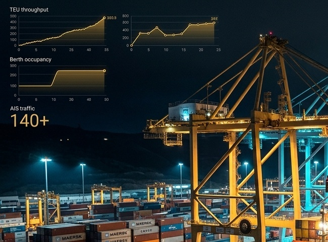
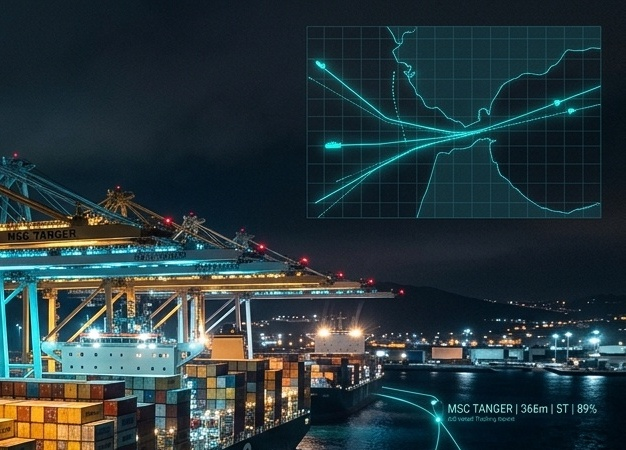
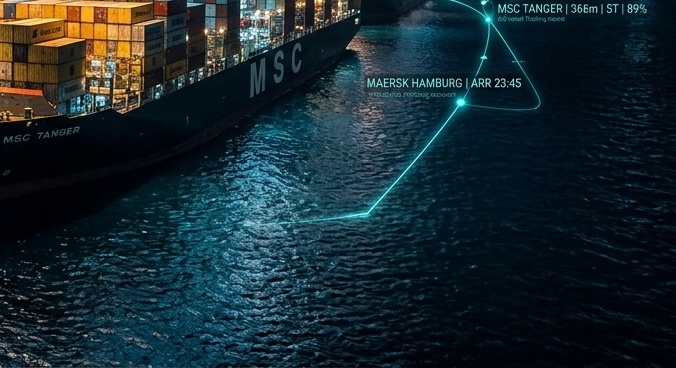
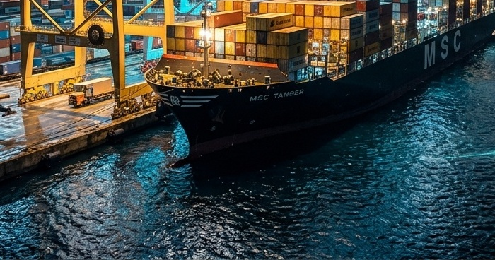

<div align="center">


# 🌐 Morocco Maritime Executive Portal & Frontend Architecture
### High-End Sci-Fi Landing Experience, Kinetic Typography & Tactical GIS Radar Interfaces

[](https://developer.mozilla.org)
[](https://greensock.com)
[](https://leafletjs.com)
[](https://www.chartjs.org)
[](https://github.com/zakariabahtani35-prog/tanger-med-maritime-intelligence)

<br/>

<p align="center">
  <b>The Official Presentation Portal & Tactical Radar Interface for Morocco's Strategic Sea Corridors:</b><br/>
  <b>Strait of Gibraltar TSS</b> • <b>Tanger Med Container Mega-Hub (TC1/TC2/TC3/TC4)</b> • <b>Casablanca Atlantic Port</b>
</p>

<p align="center">
  <a href="#-visual-interface-gallery"><b>Interface Gallery</b></a> •
  <a href="#-design-tokens--visual-palette"><b>Design Tokens</b></a> •
  <a href="#-typography-hierarchy"><b>Typography</b></a> •
  <a href="#-frontend-components--architecture"><b>Components</b></a> •
  <a href="#-animations--interaction-physics"><b>Animations & Physics</b></a> •
  <a href="#-asset-catalog"><b>Asset Catalog</b></a>
</p>

</div>

---

## 🖥️ Visual Interface Gallery

<div align="center">

| 🌐 Landing Portal Hero & Corridor Showcase | 📊 Live Tactical Analytics Dashboard |
| :---: | :---: |
| [](./assets/readme_website_preview.jpg) | [](./assets/readme_dashboard_preview.jpg) |
| *Kinetic matrix stepped cutout hero, interactive corridor exploration & vessel telemetry bento* | *High-frequency GIS spatial radar, live telemetry table, fleet composition pie chart & dwell metrics* |

| 🛰️ AIS Telemetry Stream Engine | 🌐 PostGIS Geofence Spatial Radar |
| :---: | :---: |
|  |  |
| *Real-time packet parsing with sub-second stream broadcast* | *Interactive multi-polygon corridor geofencing with vector rays* |

| 🎮 Command Center Operations | 🚢 Vessel Fleet Kinematics |
| :---: | :---: |
|  |  |
| *Tactical operations layout designed for port authority decision-making* | *Live SOG, COG, Heading, and Deadweight Tonnage monitoring per vessel* |

</div>

---

## 🎨 Design Tokens & Visual Palette

The presentation portal adheres to the **ByteCrafters Sci-Fi Luxury Maritime Token Standard**, delivering a high-contrast dark aesthetic for maximum readability and visual impact:

```css
:root {
    /* Brand Foundation */
    --bg-obsidian: #010101;
    --bg-card-dark: #0A0A0C;
    --bg-card-light: #FFFFFF;
    
    /* Brand Accents */
    --brand-crimson: #9E261A;
    --brand-cyan: #00E5FF;
    --brand-emerald: #137333;
    --brand-amber: #FEF3C7;
    
    /* Typography Colors */
    --text-pure: #FFFFFF;
    --text-muted: #8E8E93;
    --text-dark: #010101;
    
    /* Glassmorphism & Borders */
    --glass-bg: rgba(1, 1, 1, 0.75);
    --glass-border: rgba(255, 255, 255, 0.08);
    --crimson-glow: 0 0 25px rgba(158, 38, 26, 0.45);
    --cyan-glow: 0 0 20px rgba(0, 229, 255, 0.40);
}
```

<div align="center">

| Token Name | Hex Value | Swatch | Architectural Role |
| :--- | :--- | :---: | :--- |
| **Obsidian Black** | `#010101` |  | Canvas backdrop, header capsule, dark theme cards. |
| **Crimson Red** | `#9E261A` |  | Signature brand CTA buttons, live radar drift alerts, key highlights. |
| **Cyan Telemetry** | `#00E5FF` |  | Radar vector arrows, active corridor bounding lines, telemetry beacons. |
| **Crisp White** | `#FFFFFF` |  | Light theme bento surfaces, modal cards, high-contrast text. |
| **Berth Emerald** | `#137333` |  | Moored status, safe corridor traversal, nominal dwell tags. |

</div>

---

## 🔤 Typography Hierarchy

The typography marries high-tech sci-fi geometric display fonts with ultra-legible analytical sans-serifs:

```
┌─────────────────────────────────────────────────────────────────────────────┐
│ 1. DISPLAY & HEADINGS: Orbitron / Ethnocentric (900 Weight, Uppercase)      │
│    "WORLD-CLASS SOLUTIONS FOR YOUR MARITIME CORRIDOR JOURNEY."             │
├─────────────────────────────────────────────────────────────────────────────┤
│ 2. SUBHEADINGS & LABELS: Chakra Petch / Nasalization (600 Weight)           │
│    "TANGER MED MEGA-PORT • TC1/TC2 TERMINALS • STRAIT OF GIBRALTAR TSS"     │
├─────────────────────────────────────────────────────────────────────────────┤
│ 3. BODY & EDITORIAL: Rajdhani (500/600 Weight, Optimized Kerning)          │
│    "Real-time AIS telemetry stream with PostGIS spatial geofencing."        │
├─────────────────────────────────────────────────────────────────────────────┤
│ 4. TELEMETRY & METRICS: JetBrains Mono (Monospace, Fixed Width)             │
│    "MMSI: 242000001 | LAT: 35.8924°N | LON: -5.5031°W | SOG: 14.8 KTS"     │
└─────────────────────────────────────────────────────────────────────────────┘
```

---

## 🧩 Frontend Components & Architecture

### 1. `index.html` (Landing Portal Architecture)
- **Top Brand Stripe**: High-energy `#9E261A` line anchoring the top viewport.
- **Floating Pill Capsule Navigation**: Glassmorphic capsule navbar with brand glyph (`bytecrafters-by.svg`), animated link anchors with `+` glyphs, and direct CTA launch pill.
- **Stepped Pixel Matrix Hero**: Procedurally positioned CSS pixel matrix overlay over high-resolution backdrop with asymmetrical stepped cutout cards.
- **Corridor Showcase Section**: Interactive card decks covering the Strait of Gibraltar TSS, Tanger Med 1 & 2, and Casablanca Port.
- **Bento Telemetry Grid**: Multi-aspect bento modules highlighting real-time throughput, GIS radar, and AI dwell predictions.
- **FAQ Accordion & Command Footer**: Interactive expandable accordions and official ByteCrafters footer links.

### 2. `templates/dashboard.html` (Live Tactical Radar)
- **Collapsible Tactical Sidebar**: Fast navigation between Live Radar, Fleet Intelligence, Terminal Dwell, Port Congestion, and Anomaly Log.
- **Leaflet GIS Map Surface**: Dark CartoDB tile layer styled with custom SVG vessel markers, vector course tails, and glowing bounding polygon overlays.
- **Real-Time Fleet Data Table**: Interactive table with sorting, search filtering, and click-to-focus on map coordinates.
- **Telemetry HUD Cards**: Live counts of active vessels, average port dwell, high-risk anomalies, and active AIS packet frequency.
- **Live Charts**: Chart.js doughnut charts for fleet composition (Cargo, Tanker, Ferry, Tug) and bar charts for port congestion indices.

---

## ⚡ Animations & Interaction Physics (`script.js`)

1. **GSAP Kinetic Scroll Reveals**:
   - Scroll-triggered staggers across bento grid cards and feature highlights.
   - Smooth entrance animations for hero text lines using `gsap.timeline()`.
2. **Magnetic Cursor Physics**:
   - Custom magnetic attraction on interactive CTA buttons and navigation links.
3. **Smooth Anchor Navigation**:
   - Native hardware-accelerated smooth scrolling with dynamic header offset calculation.

---

## 📁 Asset Catalog (`assets/`)

```
assets/
├── bytecrafters-logo-raw.png       # Official ByteCrafters Brand Mark
├── bytecrafters-badge-dark.png     # Dark Mode Brand Badge
├── bytecrafters-badge-light.png    # Light Mode Brand Badge
├── bytecrafters-by.svg             # Minimal Vector Glyphs
├── readme_dashboard_preview.jpg    # Full-HD Dashboard UI Screenshot
├── readme_website_preview.jpg      # Full-HD Landing Page UI Screenshot
├── feature_ais_ingestion.jpg       # AIS Pipeline Showcase Graphic
├── feature_berth_analytics.jpg     # ML Dwell Analytics Graphic
├── feature_spatial_geofencing.jpg  # PostGIS Geofencing Radar Graphic
├── gallery_command_center.jpg      # Tactical Command Center Room
├── gallery_gis_geofence.jpg        # Corridor Geofence Multi-Polygon
├── gallery_port_collaboration.jpg  # Port Operational Team Hub
├── gallery_vessel_ops.jpg          # Fleet Kinematic Tracking
├── port_tangermed.jpg              # Tanger Med Mega-Port Showcase
├── port_casablanca.jpg             # Casablanca Commercial Port
└── leader_harbor_master.jpg        # Harbor Master Leadership Portrait
```

---

<div align="center">
  <sub>Developed by <b>Zakaria Bahtani</b> • Built with Vanilla Web Standards, GSAP & Leaflet.js</sub>
</div>
